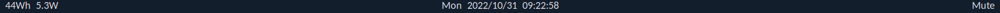

# Electrode

There are loads of customisable status bars out there. Some are suffering from
[feature creep](https://en.wikipedia.org/wiki/Feature_creep). Others pull
information from user supplied scripts, which can become highly inefficient.



Electrode has a negligible impact on the system, as all of its features are
written in Rust, and compiled into a single binary of around 1MiB.

It has no configurable options.

## Demo

You can try Electrode using the [Nix package manager](https://nixos.org/) with
Flakes enabled:

```sh
nix run github:danth/electrode
```

Building this repository directly with Cargo works too, provided you have GTK3
development packages available.

## Installation

This repository provides a [NixOS](https://nixos.org/) module which can be
imported via Flakes. See `nixos.nix` for the available options.

For other distributions, you can create the service by hand at
`/etc/systemd/user/electrode.service`:

```systemd
[Unit]
Description=Electrode status bar

After=graphical-session-pre.target
Before=graphical-session.target
PartOf=graphical-session.target
WantedBy=graphical-session.target

[Service]
ExecStart=/path/to/electrode/bin/electrode
```

You will also need to install Font Awesome for the icons.

Change `ExecStart` to the location of your compiled Electrode binary.

## Styling

Electrode will read `/etc/xdg/electrode/style.css` or `~/.config/electrode/style.css`,
if either of them exist.

This can be used to change its appearance, for example to make the background
transparent:

```css
window > box {
	background-color: rgba(0, 0, 0, 255);
}
```

Because GTK has to include a CSS parser anyway to load the default styles, this
configurability does not add much overhead.
